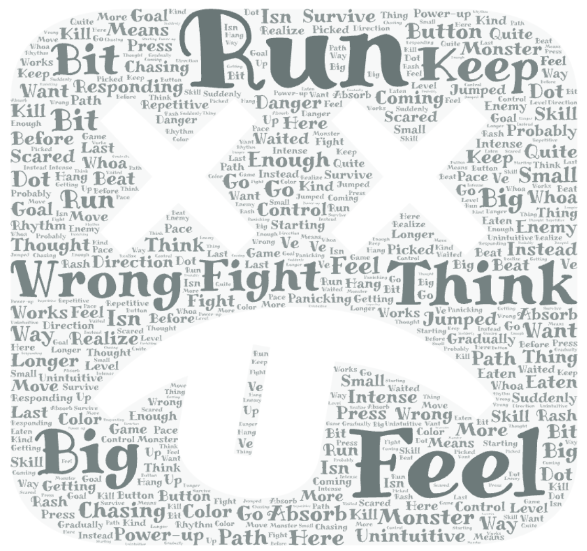

# 2025-group-29
2025 COMSM0166 group 29

| Name         | Email                 | GitHub Username |
|--------------|-----------------------|------------------|
| Weihao Zeng  | lh24059@bristol.ac.uk | Zengweihaooo     |
| Lepeng Zhou  | wn24588@bristol.ac.uk | Lepengz233       |
| Yichen Zhang | gd24475@bristol.ac.uk | Enderman928      |
| Guojie Liu   | jy24369@bristol.ac.uk | henlandl         |
| Mengqiu Yan  | zj24391@bristol.ac.uk | zj24391          |
| Chen Zhang   | ov24336@bristol.ac.uk | ov24336          |

#### **Kanban Board**  
- **HTML Version** ➡️ [View Here](https://zengweihaooo.github.io/JavaScriptGame/kanban/index.html)

#### **Drawing App**  
- **Try the App** ➡️ [Play Here](https://zengweihaooo.github.io/JavaScriptGame/games/week02_sketch/index.html)

## Your Game

Link to your game [PLAY HERE](https://uob-comsm0166.github.io/2025-group-29/)

Your game lives in the [/docs](/docs) folder, and is published using Github pages to the link above.

Include a demo video of your game here (you don't have to wait until the end, you can insert a work in progress video)

## Your Group

Add a group photo here!

| Name         | Email                 | GitHub Username |
|--------------|-----------------------|------------------|
| Weihao Zeng  | lh24059@bristol.ac.uk | Zengweihaooo     |
| Lepeng Zhou  | wn24588@bristol.ac.uk | Lepengz233       |
| Yichen Zhang | gd24475@bristol.ac.uk | Enderman928      |
| Guojie Liu   | jy24369@bristol.ac.uk | henlandl         |
| Mengqiu Yan  | zj24391@bristol.ac.uk | zj24391          |
| Chen Zhang   | ov24336@bristol.ac.uk | ov24336          |

# Project Report
## Table of Contents
- [1 Introduction](#1-introduction)
  - [1.1 Overview](#11-overview)
- [2 Art Design and Innovation](#2-art-design-and-innovation)
  - [2.1 Character State](#21-character-state)
  - [2.2 Skill And Attack Effects](#22-skill-and-attack-effects)
  - [2.3 Monster And Time Item Appearances](#23-monster-and-time-item-appearances)
  - [2.4 Bullet Types](#24-bullet-types)
  - [2.5 Visual Effects](#25-visual-effects)
- [3 Requirements](#3-requirements)
- [4 Design](#4-design)
- [5 Implementation](#5-implementation)
- [6 Evaluation](#6-evaluation)
- [7 Process](#7-process)
- [8 Conclusion](#8-conclusion)
- [9 Contribution Statement](#9-contribution-statement)
- [10 Additional Marks](#10-additional-marks)

# 1 Introduction
- 5% ~250 words 
- Describe your game, what is based on, what makes it novel? 
[Back to Table of Contents](#table-of-contents)
# 2 Art Design and Innovation
We combine our art design with creative gameplay systems to improve player interaction and make the game more fun to play.

## 2.1 Character State
Character design is combined with the skill tree system. Players can freely choose skills to build skill tree branches and styles, which activate different states.

| Image                                                           | Name        | Description                                                                           |
|-----------------------------------------------------------------|-------------|---------------------------------------------------------------------------------------|
|  | Normal mode | The normal state of the battle mecha when no skill tree branch or style is activated. |
|   | Agile mode  | The state of the battle mecha when the agile-type skill tree branch is activated.     |
|   | Power mode  | The state of the battle mecha when the power-type skill tree branch is activated.     |
|    | Tank mode   |  The state of the battle mecha when the tank-type skill tree branch is activated.     |

## 2.2 Skill And Attack Effects
Skill animations and effects are combined with art to make the game more immersive and fun for players.

| Image                                                             | Name           | Description                                                                                                                         |
|-------------------------------------------------------------------|----------------|-------------------------------------------------------------------------------------------------------------------------------------|
|  | Attack         | The animation of the character’s normal attack.                                                                                     |
|   | Ghost Cutter   | An attack boost. Increases attack power for a short time.                                                                           |
|  | Iron Reversal  | A shield skill. Creates a shield that blocks damage and can reflect bullet attacks.                                                 |
|   | Crimson Drain  | A lifesteal skill. Attacks restore some health.                                                                                     | 
|    | Phantom Dash   | A dash skill. The character dashes forward and deals area damage along the path.                                                    |
|| Wrath Unchained| A charge-up skill. After charging, it deals heavy damage to enemies in a 360-degree area and reduces damage taken while charging.   |

## 2.3 Monster And Time Item Appearances
Carefully designed monster appearances match the game’s theme and make players feel more involved.

| Image                                                               | Name             | Description                                                                                                                         |
|---------------------------------------------------------------------|------------------|-------------------------------------------------------------------------------------------------------------------------------------|
|          | Normal-monster   | Moves around within a set area.                                                                                                     |
|          | Follow-monster   | Follows and attacks the player.                                                                                                     |
|       | Invisible-monster| Becomes visible only when the player gets close, then follows and attacks.                                                          |
|   | Ambush-monster   | Rushes to attack the player quickly when close.                                                                                     | 
|         | Danmaku-monster  | Shoots bullet attacks at the player.                                                                                                |
|                      | Tower            | A device summoned by the boss.                                                                                                      |
|                  | Boss             | Has many attack moves and effects, and includes game mechanics that players need to figure out.                                     |
|                       | Time             | Players can touch it to get extra time and earn more points.                                                                        |

## 2.4 Bullet Types
Many kinds of bullets with different targets. This makes the visuals more interesting and improves the game experience.

| Image                                                               | Name                      | Description                                                                                                                         |
|---------------------------------------------------------------------|---------------------------|-------------------------------------------------------------------------------------------------------------------------------------|
|           | Monster-bullet            | Bullets shot by Danmaku-monsters.                                                                                                   |
| | Character-rebound-bullet  | Bullets reflected by player skills.                                                                                                 |
|              | Boss-bullet               | Special bullet patterns from the boss.                                                                                              |

## 2.5 Visual Effects
Rich visual effects make the game more fun and improve the player’s experience.

| Image                                                               | Description              | Image                                                                 |        Description                                                   |
|---------------------------------------------------------------------|--------------------------|-----------------------------------------------------------------------|----------------------------------------------------------------------|
|              | character-boost          |               |             character-charge                                         |
|             | character-shield         |                |             character-steal                                          |
|| character-dash-puff      |  |             character-idle-puff                                      |
|  | boss-dash-explore        |       |             boss-blackhole                                           |
|          | boss-puff                |          |             boss-summon                                              | 
|          | boss-wave                | 

[Back to Table of Contents](#table-of-contents)

# 3 Requirements 

- **As a player**
    
    > “I want the game to have a skill tree system so that I can choose and upgrade skills according to my playstyle and enhance my character's abilities. “
    > 
    
    > “I want the game to have a complete storyline so that I can immerse myself in the game world and enjoy a rich narrative experience. “
    > 
    
    > “I want the game to have a skin system so that I can customize the appearance of my character or equipment for a more personalized experience. “
    > 
    
    > “I want the game to have multiple playable characters, each with unique traits, so that I can choose the one that best fits my playstyle.  “
    > 
- **As a developer**
    
    > “I want players to enjoy our game.”
    > 
    
    > “I want to gain development skills.”
    > 
    
    > “I want to plan my time well and participate in quality teamworking.”
    > 
    
    > “I want to be a positive role model for the next cohort. “
    > 
    
    > “I want players to participate in early access testing for each version so that we can gather feedback and improve game balance patches.”
    > 
- **As a marker for this project,**
    
    > “I want to experience all core game mechanics in the shortest possible time.”
    > 
    
    > “I want to see a game that has something new and innovative, not just a simple copy of an existing game.”
    > 
    
    > “ I want to immerse myself in the game as quickly as possible after entering the main interface. “
    >
[Back to Table of Contents](#table-of-contents)
# 4 Design

- 15% ~750 words 
- System architecture. Class diagrams, behavioural diagrams. 
[Back to Table of Contents](#table-of-contents)

---
类图

在游戏开发的初期，类图能够帮助我们把握游戏结构，明确核心类、模块及其对应的职责。这有助于我们能够在原代码中规划良好的面向对象设计（OOD），例如合理拆分功能，降低开发人员之间的重复沟通成本。我们采用的GitHub+VS Code集成开发方法可据此划定feature分支（如feature/player, feature/BlackHole）。团队成员可以基于类图对类实现进行审查，让多人同时开发不同模块变得可控。

游戏结构

- LevelManager：关卡控制器。管理BaseLevel及其子类（如Level1, Level2…）每个关卡的具体实现。每个Level中又可能包含敌人生成逻辑，黑洞生成逻辑等等。
- Player: 玩家实体，包含位置、移动、生命值、技能引用等。管理/使用技能系统，检测与敌人/时间柱/子弹的交互效果。
- Enemy: 控制敌人行为逻辑。管理各个不同种类的敌人的子类，如`AmbushEnemy`, `StealthEnemy`, `BulletEnemy`, `Boss`等。
- SkillSystem: 控制所有技能的激活、冷却、HUD 显示等。管理不同的技能子类，如Dash skill, Blood fury skill等等。
- loadSaveData: 控制存档系统，用于从Supabase读取存档并加载到游戏环境中。
- 其他关键类：CollisionManager（检测玩家与敌人、黑洞、子弹等碰撞）Bullet（管理所有飞行子弹，供敌人和boss共用）MeleeAttack类（管理敌人和玩家之间的交互）

At the early stage of game development, class diagrams can help us grasp the structure of the game and clarify the core classes, modules and their corresponding responsibilities. This helps us to plan a good Object Oriented Design (OOD) in the original code, for example, to reasonably split the functions and reduce the cost of repeated communication between developers. The GitHub+VS Code integrated development methodology we adopted allows us to delineate feature branches (e.g. feature/player, feature/BlackHole) accordingly. Team members can review class implementations based on class diagrams, making simultaneous development of different modules by multiple people manageable.

Game Structure

- LevelManager: level controller. Manages the implementation of BaseLevel and its subclasses (e.g. Level1, Level2...) for each level. Each Level may contain enemy generation logic, black hole generation logic and so on.
- Player: Player entity, contains position, movement, life value, skill references, etc... Manages/uses the skill system, detects interaction with enemies/timecolumns/bullets.
- Enemy: Controls enemy behaviour logic. Manages subclasses of different types of enemies such as AmbushEnemy, StealthEnemy, BulletEnemy, Boss, etc.
- SkillSystem: Controls all skill activations, cooldowns, HUD displays, and more. Manages different skill subclasses, such as Dash skill, Blood fury skill, and so on.
- loadSaveData: Controls the archive system, used to read archives from Supabase and load them into the game environment.
- Other key classes: CollisionManager (detects player collisions with enemies, black holes, bullets, etc.) Bullet (manages all flying bullets for enemies and bosses to share) MeleeAttack class (manages interactions between enemies and players)
### Class Diagram

---
Behavioral Diagram

类图告诉我们系统中有什么，时序图告诉我们它们如何工作。我们通过绘制时序图来模拟游戏的真实运行流程（从游戏启动到关卡推进、BOSS战再到通关和结束的流程）。

在游戏启动阶段（Game Launch）加载当前关卡（如 Level1），初始化玩家属性（位置、技能槽、HP 等），初始化技能系统，绑定快捷键并注册技能，生成第一关的敌人。

当玩家通过当前关卡后，LevelManager加载下一关（Level2 至 Level5），重新生成敌人与黑洞，SkillSystem保留玩家技能，更新被动/冷却状态。

在第 5 关中，玩家将进入特别设计的 Boss 战。Boss将会释放特殊技能，玩家需要在前几关装备的技能辅助下与其进行对抗。如果 Boss 被击败，则进入最终结算页面，游戏顺利结束！

在通关时，玩家进入 shop界面，展示升级选项、奖励、恢复道具等，玩家可选择技能升级或退出游戏。

Class diagrams tell us what's in the system, sequence diagrams tell us how they work. We simulate the real flow of the game (from Game Launch to Level Advancement, Boss Battles to Pass & Finish) by drawing a timing diagram.

### Sequence Diagram

In the Game Launch phase, the current level (e.g. Level1) is loaded, player attributes are initialised (position, skill slots, HP, etc.), the skill system is initialised, shortcuts are bound, skills are registered, and enemies are generated for the first level.  

Then we enter the main game loop, InputHandler is responsible for detecting player's keystrokes (move, attack, release skills),
each module executes update() method in turn. Player class moves, attacks and calls skills. SkillSystem is responsible for skill cooldowns, sustained effects, skill state refresh. Enemy is responsible for enemy behavior. CollisionManager detects all the collision events and passes the result to HPSystem to execute the logic of deducting HP, restoring HP, shield adding, etc. This phase is a continuous loop until the level completion condition is triggered (e.g. defeating all enemies or reaching the scoring goal).

When the player passes the current level, LevelManager loads the next level (Level 2 to Level 5), regenerates the enemies and black holes. SkillSystem retains the player's skills and updates the passive/cooldown status.

In Level 5, the player will enter a specially designed Boss Battle, where the Boss will unleash a special skill and the player will need to fight against it with the help of the skills equipped in the previous levels. If the boss is defeated, the final checkout page will be displayed and the game will end successfully!

At the end of each level,  the player enters the shop screen, which displays upgrade options, rewards, recovery items, etc. The player can choose to upgrade their skills or exit the game.

# 5 Implementation

- 15% ~750 words

- Describe implementation of your game, in particular highlighting the three areas of challenge in developing your game.
- 技能系统；存档系统；Boss战

[Back to Table of Contents](#table-of-contents)

# 6 Evaluation

- 15% ~750 words

- One qualitative evaluation (your choice) 

- One quantitative evaluation (of your choice) 

- Description of how code was tested. 

# 🧠 Think-Aloud Testing: Iterative Feedback and In-Game Adjustments  
## 🎮 出声思考测试：迭代反馈与游戏内调整  

We conducted a Think-Aloud usability test with six participants (N = 6), who played through the first two levels while narrating their thoughts aloud. Verbal expressions were transcribed, tagged, and analyzed to extract user needs and usability pain points. Based on repeated themes—**confusion**, **uncertainty**, **overwhelm**, and **cognitive load**—we derived a set of actionable design responses to improve player experience.  
我们对6位用户进行了出声思考测试，让他们在游玩前两个关卡时同步表达想法。我们对其言语进行转录与标注，识别出“困惑”“不确定”“压力大”和“认知负担”等高频反馈主题，并据此提出针对性的设计优化方案。

---

### 🔍 Key Observations and Design Responses | 用户观察与设计回应  

### 🎮 Think-Aloud Feedback and Design Responses | 出声思考反馈与设计响应（中英双语）

| **User Observation** 用户观察 | **Design Response** 设计回应 |
|----------------------------|-----------------------------|
| **“Why isn’t this button responding? Did I press the wrong thing?”** **“为什么这个按钮没有反应？我是不是点错了？”** | Added a skill indicator icon in the bottom-left corner to show cooldown status. 左下角增加技能指示图标，显示技能冷却状态。 |
| **“Should I keep fighting or keep running?”** **“我现在应该继续打还是继续跑？”** | Moved the player's health bar to the top for easier risk evaluation. 把玩家血条放置到顶部，让玩家自主判断风险。 |
| **“I’m not quite sure what the goal is—is it to survive longer or to kill more?”** **“我不太清楚目标是什么——是活得更久还是杀更多？”** | Added a score system and real-time feedback to clarify high-score objectives. 增加分数显示和实时反馈机制，让玩家明确目标是获得高分。 |
| **“So that’s how this skill works—I didn’t realize it before.”** **“原来这个技能是这样用的，我刚才没看出来。”** | Enabled tooltip-on-hover on the skill shop interface. 技能商店界面支持悬停查看技能说明。 |
| **“This is so intense—I feel like danger is coming from every direction.”** **“现在压力好大，感觉四面八方都有危险。”** | Ensured a minimum safe radius around player spawn to avoid instant ambush. 保证怪物生成与玩家有一定安全距离，避免“刷脸”突袭。 |
| **“I think I’m gradually getting the hang of the game’s rhythm.”** **“我觉得我正在慢慢掌握这游戏的节奏。”** | No changes needed—this indicates pacing is working as intended. 无需调整，表明当前节奏设计合理。 |
| **“The pace suddenly picked up in this level—I’m kind of panicking.”** **“这关节奏突然变快，我有点慌。”** | Rebalanced enemy spawn frequency and added a mid-level checkpoint. 调整敌人刷新频率，在关卡中段加入检查点。 |
| **“It’s starting to feel a bit repetitive—just run, fight, run.”** **“现在有点重复了，一直逃、打、逃。”** | Introduced new non-combat segments and mechanics in Level 3 to vary the experience. 第3关加入非战斗互动机制，打破重复循环。 |

---

## 🧩 Insights & Impact  
These real-time voice comments enabled us to uncover pain points in *navigation, clarity, pacing,* and *player motivation*. Iterative adjustments based on these Think-Aloud observations significantly improved early-game experience and onboarding effectiveness.  
这些即时语音反馈帮助我们揭示了“导航”、“目标清晰度”、“节奏”和“玩家动机”等多个设计盲点。基于出声思考测试的迭代优化显著提升了前期游戏体验与引导效果。

**NASA-TLX Workload Comparison:**  

单纯比较两种难度或许并不够有趣。我们注意到，任何能够长期运营的游戏，往往在不同的主角或流派之间都维持着非常良好的平衡性。这种平衡能避免某个流派带来明显更高的工作负荷，进而引发玩家的“流派厌恶”。

**Simply comparing two difficulty levels might not be that exciting.  
What truly caught our attention is how long-lasting games often maintain a well-tuned balance between different characters or playstyles.  
This kind of balance helps prevent any one style from feeling disproportionately demanding—and avoids the dreaded “class fatigue” players can get when one option just feels like too much work.**

为了评估不同游戏流派带来的主观工作负荷，我们招募了八位参与者来体验所有三种流派。  
为了减轻顺序偏差（我们在第一次测试中确实发现了这个问题），我们采用了拉丁方设计，让每位参与者体验流派的顺序有所不同。  
这种被试内设计保证了每种流派在每个顺序位置中出现的次数均衡，从而使比较更加公平。  
（是的，我们是热爱学习新方法的好学生！）

**To evaluate the subjective workload associated with different playstyles, we recruited eight participants to experience all three gameplay archetypes.  
To mitigate potential order effects—which we actually noticed during our first round of testing—we adopted a Latin Square design to systematically vary the sequence in which each participant played the archetypes.  
This within-subjects setup ensures that each playstyle appears equally often in each position, helping us make fairer comparisons.  
(Yes, we’re good students who love to learn new methods!)**

---
### 工作负荷趋势图
[查看 NASA-TLX 原始数据 (CSV)](docs/Datas/NASA-TLX_Results.csv)

### 中文版本：

在收集完 NASA-TLX 数据后，我们使用 Python 及其可视化库 Matplotlib 绘制了三个流派（Build A、B、C）在六个维度上的平均工作负荷趋势图。从图中可以观察到三个流派在主观负荷感知上的显著差异：

🎯 **线条走势解读：**

1. **Build A（蓝色）：** 整体得分中等偏低，走势平缓；在 时间压力 与 努力程度 上略有下降，代表任务节奏轻松、投入压力较低；是一种“压力适中、操作轻松”的流派。

2. **Build B（黄色）：** 几乎在所有维度上得分最高，尤其在 努力 和 挫败感 上表现突出；表明这是玩家“最累”的流派，可能在后期引发疲劳或厌倦感。

3. **Build C（粉红色）：** 前几个维度得分较低，后段逐步上升，在 表现满意度 附近达到高点；呈现出“前轻后重”的体验节奏；表明此流派上手容易，但要精通则需要更多精神和情绪投入。

---

### 英文版本：

Upon receiving the collected NASA-TLX data, we used Python and the Matplotlib library to visualize the average workload scores across the six TLX dimensions for each playstyle (Build A, B, and C). The resulting line chart revealed distinct trends in perceived workload:

🎯 **Interpretation of Line Trends:**

1. **Build A (Blue):** Shows moderate-to-low workload scores with relatively flat progression. Slight drops in Temporal Demand and Effort suggest lower perceived pacing and cognitive investment. Represents a playstyle that feels reasonably light and accessible overall.

2. **Build B (Yellow):** Consistently scores highest in almost all dimensions, especially Effort and Frustration. Indicates a playstyle that demands the most from players, potentially leading to fatigue or disengagement in later stages.

3. **Build C (Pink):** Starts off with lower workload scores, gradually increasing toward Performance and beyond. Reflects a “light-to-heavy” experience curve—easy to start, but mentally and emotionally more demanding over time. Suggests a flow that’s approachable at first but requires deeper mastery to handle efficiently.

---

本次工作负荷评估清晰地表明，Build A 与 Build C 各具特征，但玩家在体验过程中均保持在可接受的压力范围内。两种流派引导出不同的思考节奏和操作风格，但都没有出现明显的沮丧或超载感。这说明它们在“难度与投入感”之间实现了良好的平衡，同时也提供了多样性。

相比之下，Build B 在多个 NASA-TLX 维度上的得分明显偏高，尤其是在 努力程度 和 挫败感 上表现突出。数据与玩家反馈一致表明，这一流派被普遍认为压力过重、体验曲线过于陡峭，因此被我们识别为需要调整的异常点。

基于此结果，我们已着手对 Build B 进行迭代优化，目标是降低其不必要的认知负担，并平滑其难度提升过程。我们认为问题的关键在于 反弹技能仅对远程攻击有效，实用性较低，这在对战中显著增加了玩家的操作难度。同时，该技能在释放后的特效表现较为简陋，反馈不明显，从而加重了玩家的认知负担，影响了使用体验。

针对上述问题，我们对反弹机制进行了优化，增强了其触发效果与进展反馈。特别地，我们重点修改了 Build B 的技能树，提升技能表现力，以更好地支撑其核心玩法节奏。

在完成上述调整后，我们开展了最后一轮均衡性测试以验证改进成效。

---

**The workload assessment clearly revealed that Build A and Build C each presented distinct cognitive and emotional patterns, yet both remained within an acceptable workload range. Players reported different mental strategies and pacing preferences, but neither build triggered frustration or perceived overload. This suggests that the two playstyles are well-balanced in terms of difficulty and effort, while still offering meaningful variety.**

**In contrast, Build B consistently scored significantly higher across multiple NASA-TLX dimensions, especially in Effort and Frustration. The data and player feedback aligned to indicate that this playstyle was perceived as overwhelmingly demanding, leading to a noticeably steeper cognitive load curve. Based on this, we identified Build B as a workload outlier in need of tuning.**

**As a result, we are now iterating on Build B’s design to reduce unnecessary mental overhead and smooth out sharp difficulty spikes. We believe the core issue lies in the rebound ability, which only applies to ranged attacks. Its limited practicality likely contributed to the increased difficulty during combat. Additionally, the lack of impactful visual or audio feedback after activation may have increased the player’s cognitive load and reduced perceived effectiveness.**

**To address this, we strengthened the rebound mechanic by enhancing its in-game effects and progression clarity。**
**Specifically, we reworked Build B’s skill tree to improve feedback responsiveness and better support its core playstyle.Following these adjustments, a final round of balance testing was conducted to verify improvements.**

**Cool! Scores belows 68 and great balance!!!**
[Back to Table of Contents](#table-of-contents)
# 7 Process 

- 15% ~750 words

- Teamwork. How did you work together, what tools did you use. Did you have team roles? Reflection on how you worked together.

Throughout the development of our real-time combat survival game, our team collaborated efficiently by embracing an Agile-inspired methodology. From the outset, we prioritized flexibility and iterative progress. To manage tasks effectively, we created a digital Kanban board with four clear columns: “Not Start,” “In Progress,” “Parked,” and “Done.” This visual approach allowed us to track precisely which tasks had yet to begin, which were actively being worked on, which tasks had temporarily stalled, and which were completed. The Kanban structure helped us break the development into manageable segments, clearly linking short-term tasks with broader project milestones.

Regular updates to the board occurred via our WeChat group. Team members either posted screenshots or directly updated task statuses, ensuring real-time alignment across the team. Additionally, we captured key board snapshots periodically to include in our final report for retrospective analysis.

For version control, we primarily used GitHub. Initially, we committed directly to the main branch, which quickly created issues such as merge conflicts and inconsistencies between versions. Realizing these challenges, we shifted to a trunk-based development model. Each team member managed their own feature branch, pulling and rebasing from the main branch upon completing a task, resolving conflicts locally, and then submitting a pull request. This approach significantly reduced integration issues, resulting in a stable and consistent codebase. Pull request discussions became essential for bug tracking, addressing architectural concerns, and documenting critical design decisions.

Although we did not formally assign team roles, responsibilities naturally emerged during the project's progression. One member specialized in developing the skill system and cooldown mechanics, while another concentrated on enemy AI and visual effects like trailing shadows and particle animations. This self-organized division of labor enabled us to remain agile and quickly adapt when obstacles arose. For particularly challenging tasks, such as the dash-reflect mechanics or timed skill triggers, we frequently employed pair programming. This practice improved debugging efficiency and encouraged knowledge sharing across the team.

Throughout the project, WeChat served as our primary communication tool. It provided rapid feedback and troubleshooting capabilities, enabling immediate responses to bugs or implementation questions. For broader design discussions—such as managing player death states or score displays—we held brief face-to-face meetings after our weekly Software Engineering lab sessions. These in-person interactions were particularly helpful for clarifying directions and reallocating tasks. During the reading week, we organized two dedicated UI design meetings to finalize front-end layouts and HUD placements. These sessions established a cohesive visual style early on, significantly reducing later adjustments.

As the semester progressed and workloads from other modules increased, we adapted our workflow to maintain productivity. Although we deliberately avoided assigning report writing or video editing tasks during the Easter break, we strategically utilized the pre-exam period for these deliverables. This timing enabled us to integrate key course concepts—such as usability heuristics and modular architecture principles—into our final report and reflections, enhancing both academic and practical quality.

A key strength of our team was our open and supportive communication culture. We comfortably provided direct feedback, whether on UI clarity or balancing game mechanics, and regularly revised gameplay elements based on test feedback. However, we identified one notable shortcoming: our reliance on WeChat sometimes caused our Kanban board to lag behind actual progress. To address this issue in future projects, we plan to assign a rotating “Kanban manager” role to maintain accurate and up-to-date task tracking.

Ultimately, this project provided valuable, hands-on experience with Agile principles, collaborative workflows, and team-based problem-solving. By effectively utilizing tools such as Kanban boards, Git branch workflows, code reviews, and flexible scheduling, we delivered a polished, feature-complete game on time. Most importantly, the lessons learned in teamwork, transparency, and iterative design will undoubtedly benefit us in future academic and professional endeavors.

[Back to Table of Contents](#table-of-contents)
# 8 Conclusion

- 10% ~500 words

- Reflect on project as a whole. Lessons learned. Reflect on challenges. Future work.

- 中文
- 本次项目为我们团队带来了极大的成长，不仅锻炼了实际开发能力，更帮助我们理解了完整游戏系统背后的设计逻辑与用户体验。

我们最大的收获之一，是对 系统解耦与模块化架构 的深刻理解。在项目初期，逻辑耦合较为严重，例如技能效果直接修改全局状态，导致调试复杂。后来我们将功能逐步拆分到各自类中，例如把攻击行为从 Player 中拆为 MeleeAttack 类，把技能逻辑抽象为 Skill 类，从而大幅提升了代码的复用性与可维护性。

我们也学会了如何进行 功能平衡与可玩性调试。例如在测试中发现 ReflectSkill 与 LifestealSkill 叠加时过于强大，我们通过调整冷却时间与持续时间，并限制可携带技能数量，保证游戏的挑战性和公平性。同时我们通过 HPSystem, CooldownSystem, DashResetSkill 等组件精细控制数值变化，使技能之间形成策略组合，而非堆叠无脑强。

在过程中也遇到不少挑战。例如 ChargeStrikeSkill 在释放后未能正确重置 isCharging 状态，导致玩家无法恢复移动。我们引入时间判定与状态同步，在 update() 方法中统一处理技能效果结束条件。这帮助我们掌握了如何设计 状态驱动的实时逻辑系统。

p5.js 提供了灵活的图形接口，但对复杂状态控制和大规模对象管理并不友好。我们主动设计了如 CollisionManager, DamageCalculator, PixelExplosion, SkillSystem 等辅助模块，提高了性能和可维护性。

未来，我们计划扩展以下内容：
	•	加入 关卡/波次机制，增加游戏节奏变化；
	•	添加 更多技能和升级系统，支持玩家成长路径；
	•	加入 地图障碍、陷阱，提高环境多样性；
	•	探索 本地多人协作或竞技模式；
	•	构建 排行榜系统，记录最高得分与生存时间。

总结来说，本次项目不仅帮助我们完成了一个结构复杂、玩法丰富的完整游戏，也让我们在设计模式、协作方式、技术细节和用户体验等方面都得到了全面提升。这为我们未来参与更大型的系统开发打下了坚实基础。

- English
- This project brought significant growth to our team, not only enhancing our practical development skills but also deepening our understanding of the underlying design logic and user experience of a complete game system.

- One of our greatest takeaways was the importance of system decoupling and modular architecture. In the early stages, we struggled with tightly coupled logic—for example, skill effects directly modified global states, making debugging difficult and error-prone. Over time, we refactored the system into clear, independent modules. We extracted melee behavior into a dedicated MeleeAttack class and abstracted all abilities into a base Skill class. These changes greatly improved the reusability and maintainability of our code, aligning with best practices in software engineering.

- We also learned how to perform game balancing and playability tuning. During internal playtests, we discovered that combining ReflectSkill and LifestealSkill made the player nearly invincible. To address this, we tweaked cooldown durations and effect times, and limited the number of equippable skills to preserve the game’s challenge and fairness. Meanwhile, we used components like HPSystem, CooldownSystem, and DashResetSkill to precisely manage numerical interactions, allowing us to create strategic skill synergies rather than brute-force power stacking.

- Several technical challenges emerged as well. For instance, the ChargeStrikeSkill failed to properly reset the isCharging state after activation, preventing the player from moving. We resolved this by introducing time-based state transitions and synchronizing conditions in the update() method. This taught us how to design real-time, state-driven systems that are both responsive and robust.

- Though p5.js offered flexible rendering and graphics capabilities, it did not provide built-in solutions for advanced state management or performance handling. As a result, we designed supporting modules such as CollisionManager, DamageCalculator, PixelExplosion, and SkillSystem. These custom tools significantly improved both the maintainability and runtime performance of our game, and allowed us to better handle concurrent game objects and effects.

- Looking forward, we have several goals to further evolve this project:
	- •	Introduce wave-based or level progression systems to create a dynamic difficulty curve.
	- •	Add more skills and an upgrade tree, enabling players to develop personalized strategies.
	- •	Integrate environmental elements such as obstacles, traps, and destructible terrain for gameplay variety.
	- •	Explore local co-op or PvP modes, allowing multiplayer interaction and competition.
	- •	Build a leaderboard system to track high scores and survival times for long-term player motivation.

- In summary, this project not only helped us develop a functionally rich and structurally complex game, but also gave us a deeper appreciation for design patterns, collaboration practices, technical precision, and iterative UX improvement. It served as a comprehensive training ground for large-scale system development and has prepared us well for future projects in software and game development alike.
[Back to Table of Contents](#table-of-contents)
# 9 Contribution Statement

- Provide a table of everyone's contribution, which may be used to weight individual grades. We expect that the contribution will be split evenly across team-members in most cases. Let us know as soon as possible if there are any issues with teamwork as soon as they are apparent. 
[Back to Table of Contents](#table-of-contents)
# 10 Additional Marks

You can delete this section in your own repo, it's just here for information. in addition to the marks above, we will be marking you on the following two points:

- **Quality** of report writing, presentation, use of figures and visual material (5%) 
  - Please write in a clear concise manner suitable for an interested layperson. Write as if this repo was publicly available.

- **Documentation** of code (5%)

  - Is your repo clearly organised? 
  - Is code well commented throughout?

[Back to Table of Contents](#table-of-contents)
