# 2025-group-29
2025 COMSM0166 group 29

| Name         | Email                 | GitHub Username |
|--------------|-----------------------|------------------|
| Weihao Zeng  | lh24059@bristol.ac.uk | Zengweihaooo     |
| Lepeng Zhou  | wn24588@bristol.ac.uk | Lepengz233       |
| Yichen Zhang | gd24475@bristol.ac.uk | Enderman928      |
| Guojie Liu   | jy24369@bristol.ac.uk | henlandl         |
| Mengqiu Yan  | zj24391@bristol.ac.uk | zj24391          |
| Chen Zhang   | ov24336@bristol.ac.uk | ov24336          |

#### **Kanban Board**  
- **HTML Version** ➡️ [View Here](https://zengweihaooo.github.io/JavaScriptGame/kanban/index.html)

#### **Drawing App**  
- **Try the App** ➡️ [Play Here](https://zengweihaooo.github.io/JavaScriptGame/games/week02_sketch/index.html)

## Your Game

Link to your game [PLAY HERE](https://uob-comsm0166.github.io/2025-group-29/)

Your game lives in the [/docs](/docs) folder, and is published using Github pages to the link above.

Include a demo video of your game here (you don't have to wait until the end, you can insert a work in progress video)

## Your Group

Add a group photo here!

| Name         | Email                 | GitHub Username |
|--------------|-----------------------|------------------|
| Weihao Zeng  | lh24059@bristol.ac.uk | Zengweihaooo     |
| Lepeng Zhou  | wn24588@bristol.ac.uk | Lepengz233       |
| Yichen Zhang | gd24475@bristol.ac.uk | Enderman928      |
| Guojie Liu   | jy24369@bristol.ac.uk | henlandl         |
| Mengqiu Yan  | zj24391@bristol.ac.uk | zj24391          |
| Chen Zhang   | ov24336@bristol.ac.uk | ov24336          |

# Project Report
## Table of Contents
- [1 Introduction](#1-introduction)
  - [1.1 Overview](#11-overview)
- [2 Art Design and Innovation](#2-art-design-and-innovation)
  - [2.1 Character State](#21-character-state)
  - [2.2 Skill And Attack Effects](#22-skill-and-attack-effects)
  - [2.3 Monster And Time Item Appearances](#23-monster-and-time-item-appearances)
  - 
  - [2.5 Bullet Types](#25-bullet-types)
  - [2.6 Visual Effects](#26-visual-effects)
- [3 Requirements](#3-requirements)
- [4 Design](#4-design)
- [5 Implementation](#5-implementation)
- [6 Evaluation](#6-evaluation)
  - [6.1 Think-Aloud Testing](#61-qualitative-evaluation)
  - [6.2 NASA-TLX Workload Study](#62-quantitative-evaluation)
  - [6.3 Testing Methodology](#63-testing-methodology)
- [7 Process](#7-process)
- [8 Conclusion](#8-conclusion)
- [9 Contribution Statement](#9-contribution-statement)
- [10 Additional Marks](#10-additional-marks)

# 1 Introduction
- 5% ~250 words 
- Describe your game, what is based on, what makes it novel? 
[Back to Table of Contents](#table-of-contents)
# 2 Art Design and Innovation
We combine our art design with creative gameplay systems to improve player interaction and make the game more fun to play.

## 2.1 Character State
Character design is combined with the skill tree system. Players can freely choose skills to build skill tree branches and styles, which activate different states.

| Image                                                           | Name        | Description                                                                           |
|-----------------------------------------------------------------|-------------|---------------------------------------------------------------------------------------|
|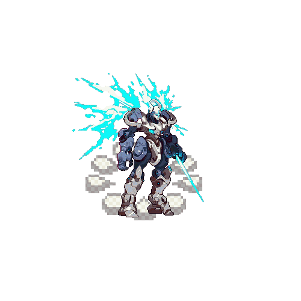  | Normal mode | The normal state of the battle mecha when no skill tree branch or style is activated. |
|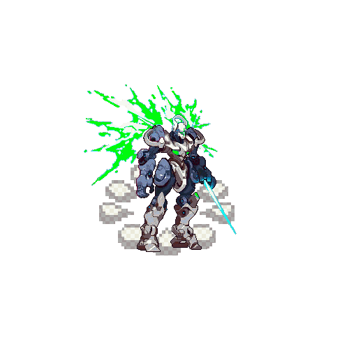   | Agile mode  | The state of the battle mecha when the agile-type skill tree branch is activated.     |
|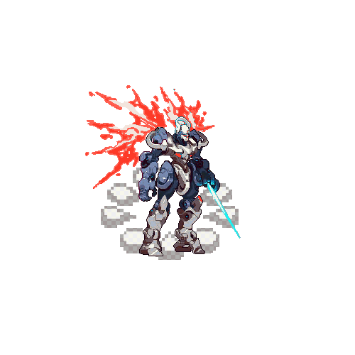   | Power mode  | The state of the battle mecha when the power-type skill tree branch is activated.     |
|    | Tank mode   |  The state of the battle mecha when the tank-type skill tree branch is activated.     |

## 2.2 Skill And Attack Effects
Skill animations and effects are combined with art to make the game more immersive and fun for players.

| Image                                                             | Name           | Description                                                                                                                         |
|-------------------------------------------------------------------|----------------|-------------------------------------------------------------------------------------------------------------------------------------|
|  | Attack         | The animation of the character’s normal attack.                                                                                     |
|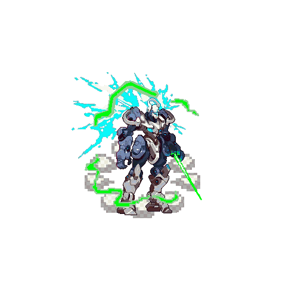   | Ghost Cutter   | An attack boost. Increases attack power for a short time.                                                                           |
|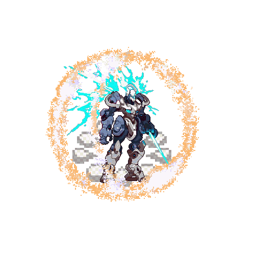  | Iron Reversal  | A shield skill. Creates a shield that blocks damage and can reflect bullet attacks.                                                 |
|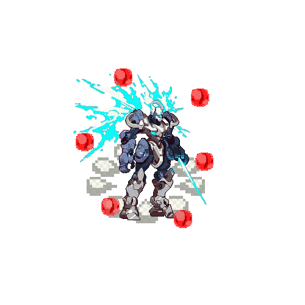   | Crimson Drain  | A lifesteal skill. Attacks restore some health.                                                                                     | 
|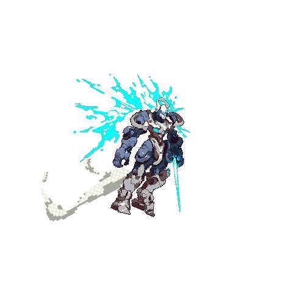    | Phantom Dash   | A dash skill. The character dashes forward and deals area damage along the path.                                                    |
|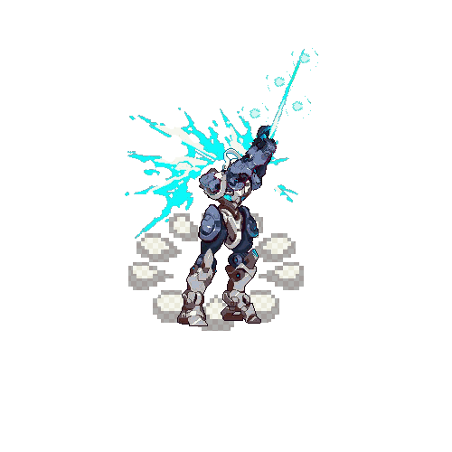| Wrath Unchained| A charge-up skill. After charging, it deals heavy damage to enemies in a 360-degree area and reduces damage taken while charging.   |
|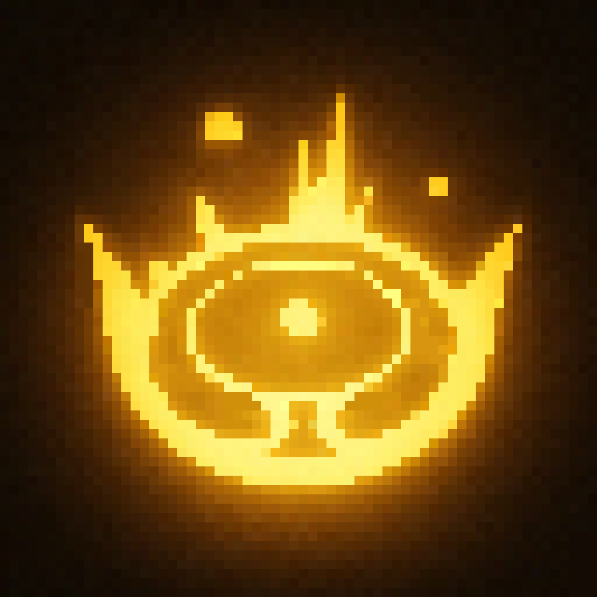                    | Anchor Field     | Summons a slow-down field in a 360-degree area. Enemies that come close will be slowed down.                                        |
|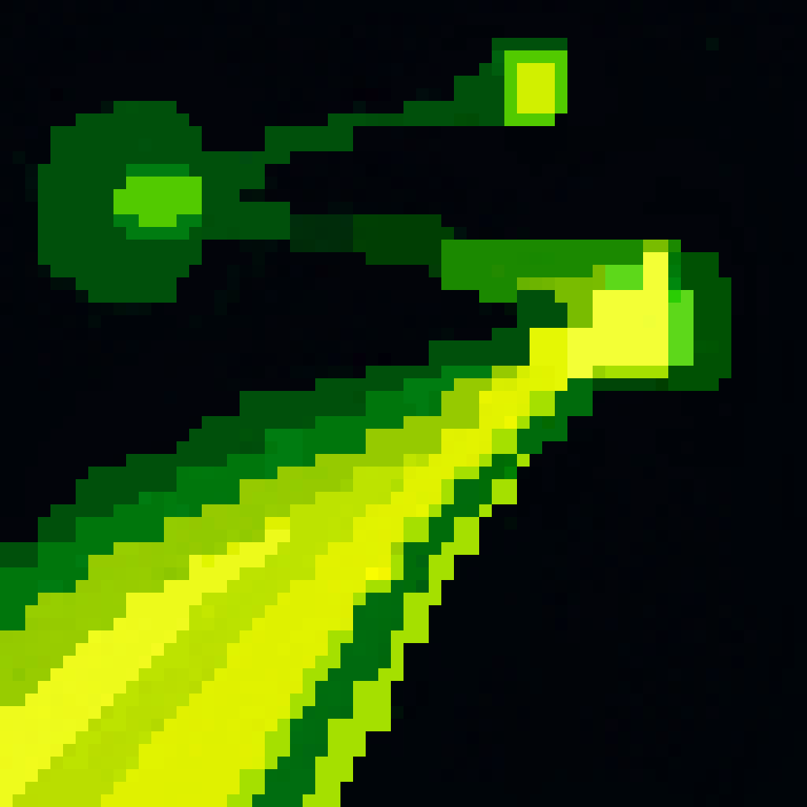                    | Runner’s Instinct| Passive skill after activating the agility skill tree style: if you kill an enemy, your Phantom Dash skill will be refreshed.       |
|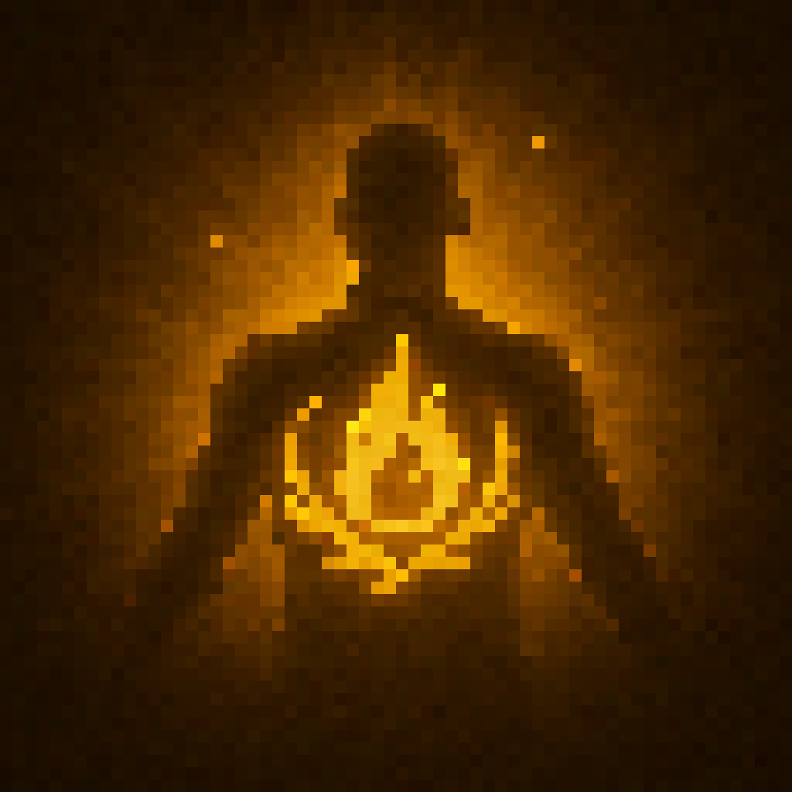                    | Guardian’s Will  | Passive skill after activating the tank skill tree style: enemies take damage while inside the Anchor Field skill, and the damage dealt will be added to the value of the next Iron Reversal skill.   |
|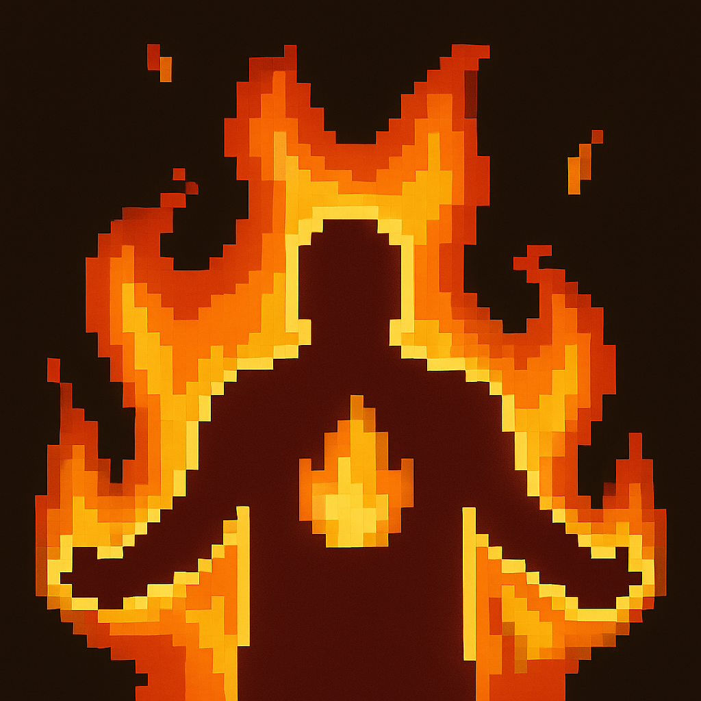                    | Berserker’s Blood| Passive skill after activating the power skill tree style: when the player's health is below a certain percentage, their attack power is greatly increased.  |

## 2.3 Monster And Time Item Appearances
Carefully designed monster appearances match the game’s theme and make players feel more involved.

| Image                                                               | Name             | Description                                                                                                                         |
|---------------------------------------------------------------------|------------------|-------------------------------------------------------------------------------------------------------------------------------------|
|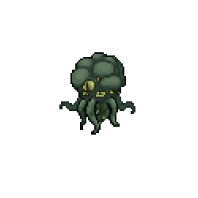          | Normal-monster   | Moves around within a set area.                                                                                                     |
|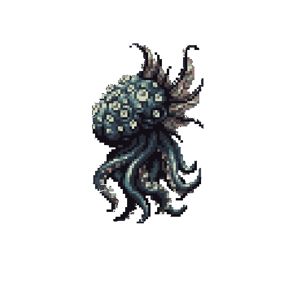          | Follow-monster   | Follows and attacks the player.                                                                                                     |
|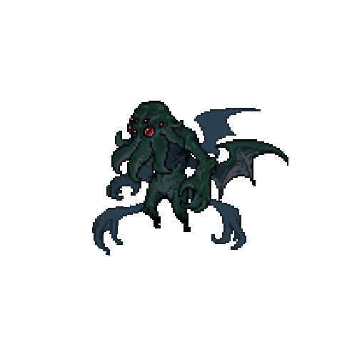       | Invisible-monster| Becomes visible only when the player gets close, then follows and attacks.                                                          |
|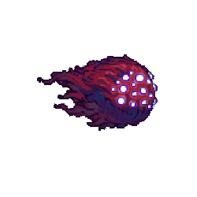   | Ambush-monster   | Rushes to attack the player quickly when close.                                                                                     | 
|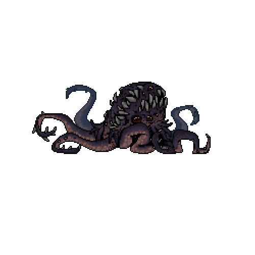         | Danmaku-monster  | Shoots bullet attacks at the player.                                                                                                |
|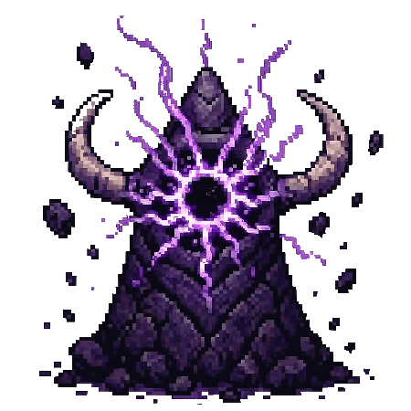                      | Tower            | A device summoned by the boss.                                                                                                      |
|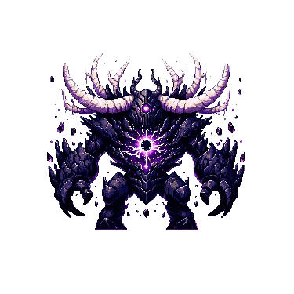                  | Boss             | Has many attack moves and effects, and includes game mechanics that players need to figure out.                                     |
|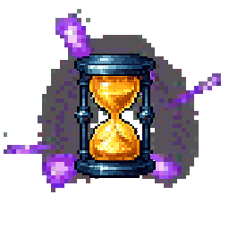                       | Time             | Players can touch it to get extra time and earn more points.                                                                        |

## 2.4 Boss skill animation showcase.
The boss has carefully designed skill animations and challenge mechanics. These increase the game’s difficulty and require players to use their chosen skill tree skills wisely in battle, making the game more exciting and fun.

| Image                                                               |  Description                                                                                                                         |
|---------------------------------------------------------------------|--------------------------------------------------------------------------------------------------------------------------------------|
|       |    The boss summons a black hole to limit the player’s movement area.              |
|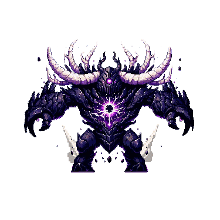                  |    The boss dashes forward to attack the player, leaving a trail that deals damage.                                                  |
|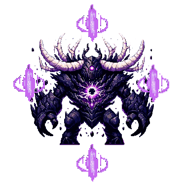                |    The boss summons ambush enemies that chase and attack the player.                                                        |
|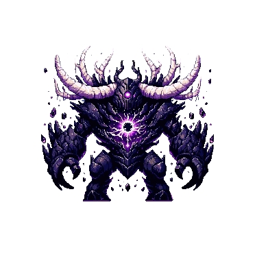           |    The boss summons bullet attacks, and the player must dodge them while completing certain mechanics, or they will be punished.            | 
|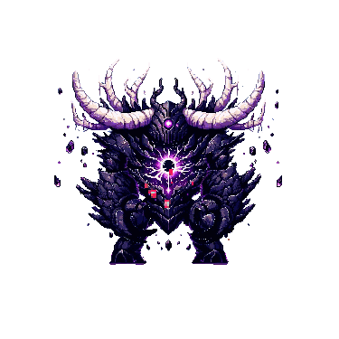             |                                                                                               |

## 2.5 Bullet Types
Many kinds of bullets with different targets. This makes the visuals more interesting and improves the game experience.

| Image                                                               | Name                      | Description                                                                                                                         |
|---------------------------------------------------------------------|---------------------------|-------------------------------------------------------------------------------------------------------------------------------------|
|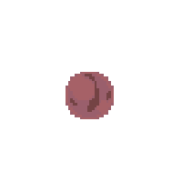           | Monster-bullet            | Bullets shot by Danmaku-monsters.                                                                                                   |
|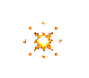 | Character-rebound-bullet  | Bullets reflected by player skills.                                                                                                 |
|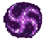              | Boss-bullet               | Special bullet patterns from the boss.                                                                                              |

## 2.6 Visual Effects
Rich visual effects make the game more fun and improve the player’s experience.

| Image                                                               | Description              | Image                                                                 |        Description                                                   |
|---------------------------------------------------------------------|--------------------------|-----------------------------------------------------------------------|----------------------------------------------------------------------|
|              | character-boost          | 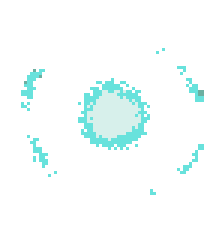              |             character-charge                                         |
|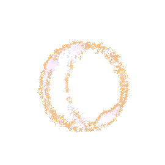             | character-shield         |                |             character-steal                                          |
|| character-dash-puff      | 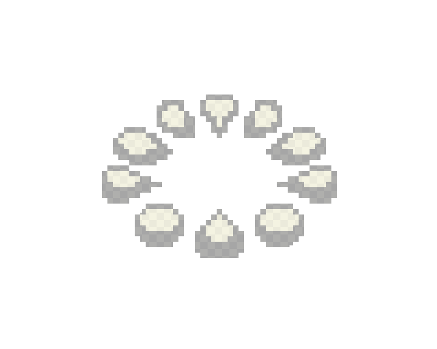 |             character-idle-puff                                      |
|  | boss-dash-explore        |       |             boss-blackhole                                           |
|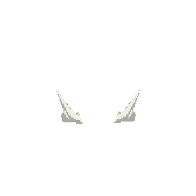          | boss-puff                | 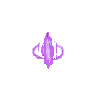         |             boss-summon                                              | 
|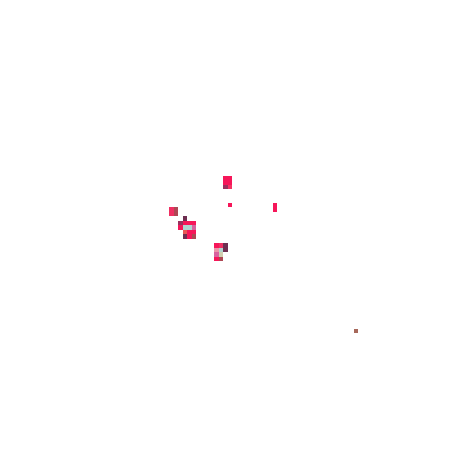          | boss-wave                | 

[Back to Table of Contents](#table-of-contents)

# 3 Requirements 

- **As a player**
    
    > “I want the game to have a skill tree system so that I can choose and upgrade skills according to my playstyle and enhance my character's abilities. “
    > 
    
    > “I want the game to have a complete storyline so that I can immerse myself in the game world and enjoy a rich narrative experience. “
    > 
    
    > “I want the game to have a skin system so that I can customize the appearance of my character or equipment for a more personalized experience. “
    > 
    
    > “I want the game to have multiple playable characters, each with unique traits, so that I can choose the one that best fits my playstyle.  “
    > 
- **As a developer**
    
    > “I want players to enjoy our game.”
    > 
    
    > “I want to gain development skills.”
    > 
    
    > “I want to plan my time well and participate in quality teamworking.”
    > 
    
    > “I want to be a positive role model for the next cohort. “
    > 
    
    > “I want players to participate in early access testing for each version so that we can gather feedback and improve game balance patches.”
    > 
- **As a marker for this project,**
    
    > “I want to experience all core game mechanics in the shortest possible time.”
    > 
    
    > “I want to see a game that has something new and innovative, not just a simple copy of an existing game.”
    > 
    
    > “ I want to immerse myself in the game as quickly as possible after entering the main interface. “
    >
[Back to Table of Contents](#table-of-contents)
# 4 Design

- 15% ~750 words 
- System architecture. Class diagrams, behavioural diagrams. 
[Back to Table of Contents](#table-of-contents)

---
类图

在游戏开发的初期，类图能够帮助我们把握游戏结构，明确核心类、模块及其对应的职责。这有助于我们能够在原代码中规划良好的面向对象设计（OOD），例如合理拆分功能，降低开发人员之间的重复沟通成本。我们采用的GitHub+VS Code集成开发方法可据此划定feature分支（如feature/player, feature/BlackHole）。团队成员可以基于类图对类实现进行审查，让多人同时开发不同模块变得可控。

游戏结构

- LevelManager：关卡控制器。管理BaseLevel及其子类（如Level1, Level2…）每个关卡的具体实现。每个Level中又可能包含敌人生成逻辑，黑洞生成逻辑等等。
- Player: 玩家实体，包含位置、移动、生命值、技能引用等。管理/使用技能系统，检测与敌人/时间柱/子弹的交互效果。
- Enemy: 控制敌人行为逻辑。管理各个不同种类的敌人的子类，如`AmbushEnemy`, `StealthEnemy`, `BulletEnemy`, `Boss`等。
- SkillSystem: 控制所有技能的激活、冷却、HUD 显示等。管理不同的技能子类，如Dash skill, Blood fury skill等等。
- loadSaveData: 控制存档系统，用于从Supabase读取存档并加载到游戏环境中。
- 其他关键类：CollisionManager（检测玩家与敌人、黑洞、子弹等碰撞）Bullet（管理所有飞行子弹，供敌人和boss共用）MeleeAttack类（管理敌人和玩家之间的交互）

At the early stage of game development, class diagrams can help us grasp the structure of the game and clarify the core classes, modules and their corresponding responsibilities. This helps us to plan a good Object Oriented Design (OOD) in the original code, for example, to reasonably split the functions and reduce the cost of repeated communication between developers. The GitHub+VS Code integrated development methodology we adopted allows us to delineate feature branches (e.g. feature/player, feature/BlackHole) accordingly. Team members can review class implementations based on class diagrams, making simultaneous development of different modules by multiple people manageable.

Game Structure

- LevelManager: level controller. Manages the implementation of BaseLevel and its subclasses (e.g. Level1, Level2...) for each level. Each Level may contain enemy generation logic, black hole generation logic and so on.
- Player: Player entity, contains position, movement, life value, skill references, etc... Manages/uses the skill system, detects interaction with enemies/timecolumns/bullets.
- Enemy: Controls enemy behaviour logic. Manages subclasses of different types of enemies such as AmbushEnemy, StealthEnemy, BulletEnemy, Boss, etc.
- SkillSystem: Controls all skill activations, cooldowns, HUD displays, and more. Manages different skill subclasses, such as Dash skill, Blood fury skill, and so on.
- loadSaveData: Controls the archive system, used to read archives from Supabase and load them into the game environment.
- Other key classes: CollisionManager (detects player collisions with enemies, black holes, bullets, etc.) Bullet (manages all flying bullets for enemies and bosses to share) MeleeAttack class (manages interactions between enemies and players)
### Class Diagram

---
Use Case Diagram
虽然我们在类图中已经表现了所有关键功能的结构支持，但为了更清晰地呈现玩家与系统各个模块之间的交互行为，我们还绘制了一张 Use Case Diagram，将类图中不易直观看出的玩家视角行为路径具体化，例如各类技能之间（主动技能和被动技能）的前后关系。

该图展示了玩家如何通过 InputHandler 控制移动、如何与 SkillSystem 交互释放技能、如何与 LevelManager 进入关卡/挑战 Boss 等系统协同运作的整体流程。

Although all key functionalities are already represented in the class diagram, we have also created a Use Case Diagram to more clearly illustrate the interactions between the player and various system modules. This diagram helps visualize the behavior paths from the player's perspective that are not easily inferred from the class diagram, such as the sequential relationships between different types of skills (active and passive).

The diagram shows how the player uses the InputHandler to control movement, interacts with the SkillSystem to activate skills, and engages with the LevelManager to enter levels or challenge bosses, providing a comprehensive view of how these systems work together.

### Use Case Diagram

---
Behavioral Diagram

类图告诉我们系统中有什么，use case diagram描述的是玩家能做什么，时序图则告诉我们系统如何一步一步实现这种行为。我们通过绘制时序图来模拟游戏的真实运行流程（从游戏启动到关卡推进、BOSS战再到通关和结束的流程）。

在游戏启动阶段（Game Launch）加载当前关卡（如 Level1），初始化玩家属性（位置、技能槽、HP 等），初始化技能系统，绑定快捷键并注册技能，生成第一关的敌人。

当玩家通过当前关卡后，LevelManager加载下一关（Level2 至 Level5），重新生成敌人与黑洞，SkillSystem保留玩家技能，更新被动/冷却状态。

在第 5 关中，玩家将进入特别设计的 Boss 战。Boss将会释放特殊技能，玩家需要在前几关装备的技能辅助下与其进行对抗。如果 Boss 被击败，则进入最终结算页面，游戏顺利结束！

在通关时，玩家进入 shop界面，展示升级选项、奖励、恢复道具等，玩家可选择技能升级或退出游戏。

The class diagram tells us what exists in the system, the use case diagram describes what the player can do, and the sequence diagram illustrates how the system carries out these actions step by step. By creating a sequence diagram, we simulate the actual gameplay process—from game launch, level progression, and boss battles to level completion and game end.

### Sequence Diagram

In the Game Launch phase, the current level (e.g. Level1) is loaded, player attributes are initialised (position, skill slots, HP, etc.), the skill system is initialised, shortcuts are bound, skills are registered, and enemies are generated for the first level.  

Then we enter the main game loop, InputHandler is responsible for detecting player's keystrokes (move, attack, release skills),
each module executes update() method in turn. Player class moves, attacks and calls skills. SkillSystem is responsible for skill cooldowns, sustained effects, skill state refresh. Enemy is responsible for enemy behavior. CollisionManager detects all the collision events and passes the result to HPSystem to execute the logic of deducting HP, restoring HP, shield adding, etc. This phase is a continuous loop until the level completion condition is triggered (e.g. defeating all enemies or reaching the scoring goal).

When the player passes the current level, LevelManager loads the next level (Level 2 to Level 5), regenerates the enemies and black holes. SkillSystem retains the player's skills and updates the passive/cooldown status.

In Level 5, the player will enter a specially designed Boss Battle, where the Boss will unleash a special skill and the player will need to fight against it with the help of the skills equipped in the previous levels. If the boss is defeated, the final checkout page will be displayed and the game will end successfully!

At the end of each level,  the player enters the shop screen, which displays upgrade options, rewards, recovery items, etc. The player can choose to upgrade their skills or exit the game.

# 5 Implementation

- 15% ~750 words

- Describe implementation of your game, in particular highlighting the three areas of challenge in developing your game.
- 技能系统；存档系统；Boss战

[Back to Table of Contents](#table-of-contents)

# 6 Evaluation

- **One qualitative evaluation:** Think-Aloud testing  
- **One quantitative evaluation:** NASA-TLX workload analysis  
- **Description of how code was tested**

## 6.1 Qualitative Evaluation

### Think-Aloud Testing: Iterative Feedback and In-Game Adjustments  

We conducted a Think-Aloud usability test with six participants (**N = 6**) who played through the first two levels while narrating their thoughts aloud. Verbal expressions were transcribed, tagged, and analyzed to extract user needs and usability pain-points. Based on repeated themes—**confusion**, **uncertainty**, **overwhelm**, and **cognitive load**—we derived a set of actionable design responses to improve player experience.

### Key Observations and Design Responses  

| **User Observation** | **Design Response** |
|----------------------|---------------------|
| “Why isn’t this button responding? Did I press the wrong thing?” | Added a skill-cooldown indicator in the bottom-left corner. |
| “Should I keep fighting or keep running?” | Moved the player’s health bar to the top for easier risk evaluation. |
| “I’m not quite sure what the goal is—is it to survive longer or to kill more?” | Added a score display and real-time feedback to clarify objectives. |
| “So that’s how this skill works—I didn’t realize it before.” | Enabled tooltip-on-hover in the skill shop. |
| “This is so intense—I feel like danger is coming from every direction.” | Ensured a minimum safe radius around the player’s spawn point. |
| “I think I’m gradually getting the hang of the game’s rhythm.” | No changes needed—pacing is working as intended. |
| “The pace suddenly picked up in this level—I’m kind of panicking.” | Re-balanced enemy spawn frequency and added a mid-level checkpoint. |
| “It’s starting to feel a bit repetitive—just run, fight, run.” | Introduced non-combat segments and new mechanics in Level&nbsp;3. |

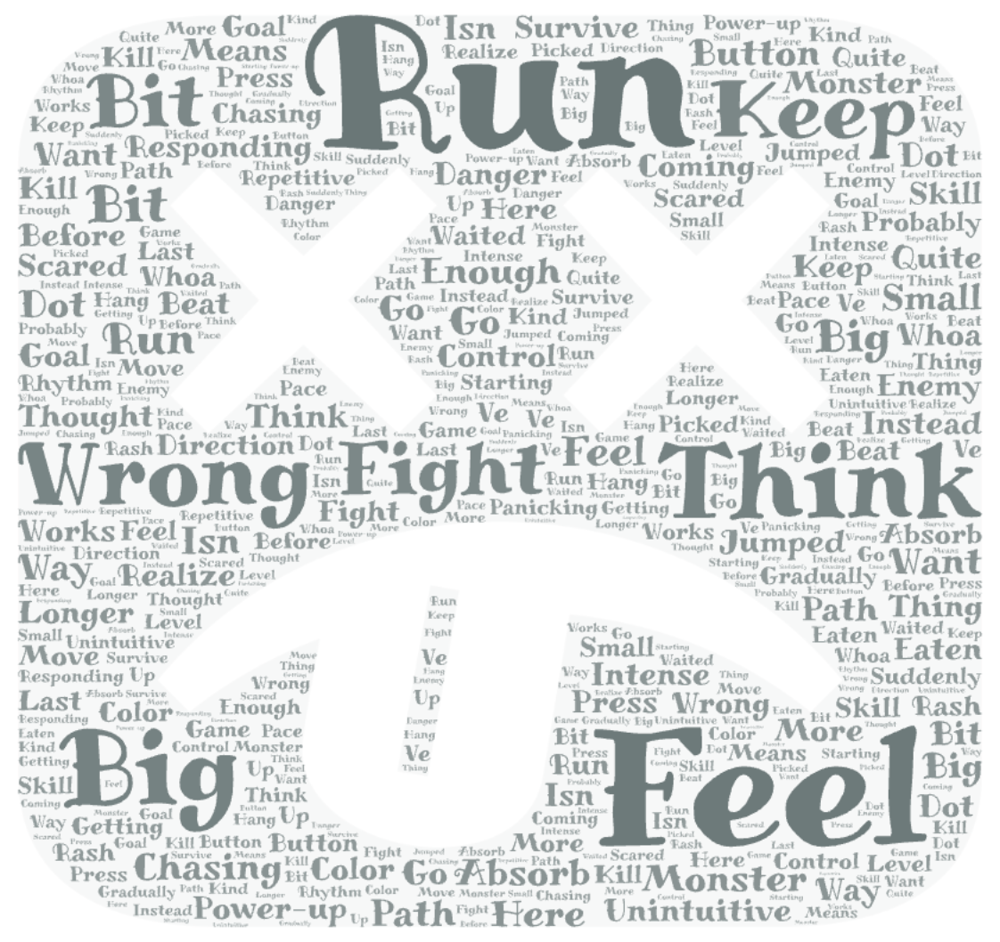

### Insights & Impact  

These real-time voice comments exposed pain-points in **navigation, clarity, pacing,** and **player motivation**. Iterative adjustments based on these observations significantly improved onboarding and early-game engagement.

---

## 6.2 Quantitative Evaluation

### NASA-TLX Workload Analysis  

Simply comparing two difficulty levels might not be that exciting. Long-lasting games often maintain a well-tuned balance between different characters or playstyles. This balance helps prevent any one style from feeling disproportionately demanding and avoids the dreaded “class fatigue” that arises when an option feels like too much work.

To evaluate the subjective workload associated with different playstyles, we recruited eight participants to experience all three gameplay archetypes. To mitigate potential order effects—which we noticed during our first round of testing—we adopted a Latin-Square design that systematically varied the sequence in which each participant played the archetypes. This within-subjects setup ensures that each playstyle appears equally often in each position, helping us make fairer comparisons.(YES! We are such good students who learn new methods on our own)

### Workload Trend  

[View raw NASA-TLX data (CSV)](docs/Datas/NASA-TLX_Results.csv)  

  

Upon receiving the collected NASA-TLX data, we used Python and Matplotlib to visualize the average workload scores across the six TLX dimensions for each playstyle (Build&nbsp;A, B, C). The resulting line chart revealed distinct trends:

1. **Build&nbsp;A (Blue):** Moderate-to-low scores with a flat progression; slight drops in *Temporal Demand* and *Effort* indicate lighter pacing and cognitive investment.  
2. **Build&nbsp;B (Yellow):** Consistently highest in almost all dimensions, especially *Effort* and *Frustration*; the most demanding playstyle, likely to cause fatigue in later stages.  
3. **Build&nbsp;C (Pink):** Starts low, then gradually increases toward *Performance*; a “light-to-heavy” curve—easy to start, but more demanding over time.

The workload assessment revealed that Builds&nbsp;A and C remained within an acceptable range, providing variety without triggering frustration or overload. In contrast, Build&nbsp;B was identified as a workload outlier in need of tuning.

We iterated on Build&nbsp;B’s rebound mechanic—enhancing its in-game effects, feedback clarity, and skill-tree support—to reduce unnecessary mental overhead and smooth difficulty spikes. A final balance test confirmed that all builds now score below the 68-point NASA-TLX threshold.

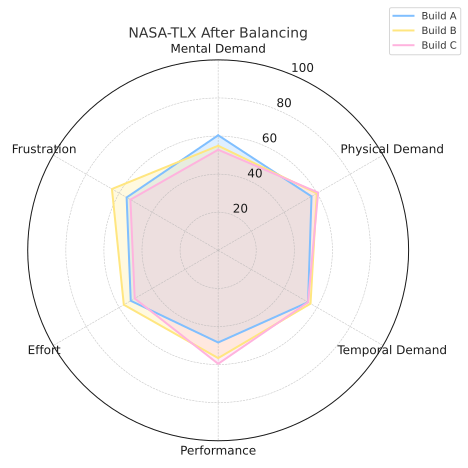  
**Cool! Scores below 68 and great balance!**

---

## 6.3 Testing Methodology  

We followed a **black-box, feature-oriented** strategy. Each core module—Skill System, Enemy AI, Save/Load API, and Level Timer—was treated as an independent unit. For every unit we listed its outward-facing features, then wrote concise test cases that stress **boundary conditions** (e.g., last frame of invincibility, timer hitting 0 s, max concurrent bullets, empty Supabase response).  

This uncovered edge bugs such as:  

* the player clipping into the boss gate at exactly `x = 0`,  
* bullet hit-boxes shrinking to zero when speed > 14 px / frame,  
* save files failing when a UID string reached 36 chars.  

After adjusting collision radii, bullet speed caps, and database field lengths, all cases passed a second run of the same black-box suite, giving us confidence in gameplay stability across levels and devices.  

[Back to Table of Contents](#table-of-contents)

# 7 Process 

- 15% ~750 words

- Teamwork. How did you work together, what tools did you use. Did you have team roles? Reflection on how you worked together.

Throughout the development of our real-time combat survival game, our team collaborated efficiently by embracing an Agile-inspired methodology. From the outset, we prioritized flexibility and iterative progress. To manage tasks effectively, we created a digital Kanban board with four clear columns: “Not Start,” “In Progress,” “Parked,” and “Done.” This visual approach allowed us to track precisely which tasks had yet to begin, which were actively being worked on, which tasks had temporarily stalled, and which were completed. The Kanban structure helped us break the development into manageable segments, clearly linking short-term tasks with broader project milestones.

Regular updates to the board occurred via our WeChat group. Team members either posted screenshots or directly updated task statuses, ensuring real-time alignment across the team. Additionally, we captured key board snapshots periodically to include in our final report for retrospective analysis.

For version control, we primarily used GitHub. Initially, we committed directly to the main branch, which quickly created issues such as merge conflicts and inconsistencies between versions. Realizing these challenges, we shifted to a trunk-based development model. Each team member managed their own feature branch, pulling and rebasing from the main branch upon completing a task, resolving conflicts locally, and then submitting a pull request. This approach significantly reduced integration issues, resulting in a stable and consistent codebase. Pull request discussions became essential for bug tracking, addressing architectural concerns, and documenting critical design decisions.

Although we did not formally assign team roles, responsibilities naturally emerged during the project's progression. One member specialized in developing the skill system and cooldown mechanics, while another concentrated on enemy AI and visual effects like trailing shadows and particle animations. This self-organized division of labor enabled us to remain agile and quickly adapt when obstacles arose. For particularly challenging tasks, such as the dash-reflect mechanics or timed skill triggers, we frequently employed pair programming. This practice improved debugging efficiency and encouraged knowledge sharing across the team.

Throughout the project, WeChat served as our primary communication tool. It provided rapid feedback and troubleshooting capabilities, enabling immediate responses to bugs or implementation questions. For broader design discussions—such as managing player death states or score displays—we held brief face-to-face meetings after our weekly Software Engineering lab sessions. These in-person interactions were particularly helpful for clarifying directions and reallocating tasks. During the reading week, we organized two dedicated UI design meetings to finalize front-end layouts and HUD placements. These sessions established a cohesive visual style early on, significantly reducing later adjustments.

As the semester progressed and workloads from other modules increased, we adapted our workflow to maintain productivity. Although we deliberately avoided assigning report writing or video editing tasks during the Easter break, we strategically utilized the pre-exam period for these deliverables. This timing enabled us to integrate key course concepts—such as usability heuristics and modular architecture principles—into our final report and reflections, enhancing both academic and practical quality.

A key strength of our team was our open and supportive communication culture. We comfortably provided direct feedback, whether on UI clarity or balancing game mechanics, and regularly revised gameplay elements based on test feedback. However, we identified one notable shortcoming: our reliance on WeChat sometimes caused our Kanban board to lag behind actual progress. To address this issue in future projects, we plan to assign a rotating “Kanban manager” role to maintain accurate and up-to-date task tracking.

Ultimately, this project provided valuable, hands-on experience with Agile principles, collaborative workflows, and team-based problem-solving. By effectively utilizing tools such as Kanban boards, Git branch workflows, code reviews, and flexible scheduling, we delivered a polished, feature-complete game on time. Most importantly, the lessons learned in teamwork, transparency, and iterative design will undoubtedly benefit us in future academic and professional endeavors.

[Back to Table of Contents](#table-of-contents)
# 8 Conclusion

- 10% ~500 words

- Reflect on project as a whole. Lessons learned. Reflect on challenges. Future work.

Looking back on the entire project, what we implemented in this game, we learnt how team members can collaborate with each other to achieve a game's output, and we also learnt solid system design through the game's design process. From the early stages of the project, we set a clear goal: to create a modular, extensible framework that could support multiple levels with different mechanics - sneak, ambush, pop-ups, boss battles, etc. - while at the same time sharing features such as player movement collision detection, skill management and remote archiving. To realise this vision, we recognised the importance of pre-planning the architectural design. We defined clear abstract classes, such as BaseLevel, Enemy, Skill, CollisionManager, etc., so that new features could be integrated smoothly and with less coupling. Through the design of SpriteManager and Skill Stacking Queue, we learned to decouple the rendering logic from the game logic, resulting in smoother character animations. The remote archiving feature uses Supabase to further understand the details of asynchronous data loading, such as how to ensure that the main game loop is not started until loadSaveData() completes, and how to provide friendly error feedback in the event of network exceptions.

Throughout the development process, we faced a number of challenges that became valuable learning opportunities. In order to balance performance and visual effects in a browser-based canvas environment, we analysed and optimised the performance of the code's hotspot paths, especially the particle effects in PixelExplosion and the per-frame halo drawing in the SlowField skill. Implementing complex boss behaviours (e.g. multi-stage ring barrage, tower deployment, dash explosion attack, black hole attraction mechanic), we realised how crucial it is to build a stable state machine with a precise timing control system. When debugging collision detection between a high-speed moving sprint trajectory and an out-of-field enemy generation point, we gained a deeper grasp of the logical handling of spatial demarcation strategies independent of frame rate. In addition, managing complex interactions between skills (e.g., controlling the timing of LifestealSkill triggers or accumulating Guardian's Will shields) also taught us that the integrity of unit testing and clear logic of the cooldown mechanism are key to ensuring the stability of the system.

During the course of the project, we also gained a lot of soft skills. For example, the use of bilingual (English comment structure, Chinese documented context) to write clear code comments improved the efficiency of collaboration; unified naming conventions and ES6 modular import mechanism enhanced maintainability; regular review and refactoring of shared logic effectively prevented the emergence of ‘spaghetti code’. We've also come to accept that iteration is progress: early prototypes were fragile, but as we continued to optimise, the code base became solid and reliable, providing a solid foundation for expanding functionality.

Looking ahead, the project still has a lot of room for improvement and expansion in basic aspects. For example, more rich designs can be made on the types of enemies and their behavioural patterns, for example, there are still places worth optimizing the logic of enemy generation, which can make the player's gaming experience more refreshing and challenging; the player's skill system can be expanded more, firstly, more genres can be developed to improve the richness of the game; secondly, the skill combinations can be made more flexible in order to improve the game's Secondly, the combination of skills can be made more flexible to improve the strategy of the game; in terms of interface design, clearer game guides or tutorials can be added to help new players quickly understand the rules of the game and the way of operation; consideration can be given to the addition of a simple achievement system or a points leaderboard to stimulate the players' interest in repeated challenges and competition; moreover, basic features such as auto-save and multiple archive slots can also be added in terms of the archive function to avoid the players losing their progress due to unforeseen circumstances. 

In addition, there are also a lot of places that can be optimised at the code level. Structurally, the decoupling between modules can be further enhanced to reduce the complexity of the code, and the error handling mechanism can be strengthened to make the game run more stable and easy to maintain.

In conclusion, this project has provided us with solid development experience and architectural design foundation, and in the future, we can further optimise and enrich the game content from these basic directions above, and continue to improve the player experience.

[Back to Table of Contents](#table-of-contents)
# 9 Contribution Statement

- Provide a table of everyone's contribution, which may be used to weight individual grades. We expect that the contribution will be split evenly across team-members in most cases. Let us know as soon as possible if there are any issues with teamwork as soon as they are apparent. 
[Back to Table of Contents](#table-of-contents)
# 10 Additional Marks

You can delete this section in your own repo, it's just here for information. in addition to the marks above, we will be marking you on the following two points:

- **Quality** of report writing, presentation, use of figures and visual material (5%) 
  - Please write in a clear concise manner suitable for an interested layperson. Write as if this repo was publicly available.

- **Documentation** of code (5%)

  - Is your repo clearly organised? 
  - Is code well commented throughout?

[Back to Table of Contents](#table-of-contents)
