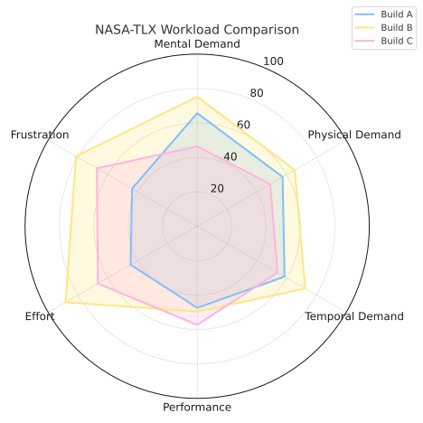
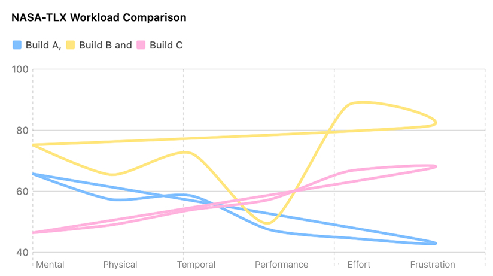

# 2025-group-29
2025 COMSM0166 group 29

| Name         | Email                 | GitHub Username |
|--------------|-----------------------|------------------|
| Weihao Zeng  | lh24059@bristol.ac.uk | Zengweihaooo     |
| Lepeng Zhou  | wn24588@bristol.ac.uk | Lepengz233       |
| Yichen Zhang | gd24475@bristol.ac.uk | Enderman928      |
| Guojie Liu   | jy24369@bristol.ac.uk | henlandl         |
| Mengqiu Yan  | zj24391@bristol.ac.uk | zj24391          |
| Chen Zhang   | ov24336@bristol.ac.uk | ov24336          |

#### **Kanban Board**  
- **HTML Version** ➡️ [View Here](https://zengweihaooo.github.io/JavaScriptGame/kanban/index.html)

#### **Drawing App**  
- **Try the App** ➡️ [Play Here](https://zengweihaooo.github.io/JavaScriptGame/games/week02_sketch/index.html)

## Your Game

Link to your game [PLAY HERE](https://uob-comsm0166.github.io/2025-group-29/)

Your game lives in the [/docs](/docs) folder, and is published using Github pages to the link above.

Include a demo video of your game here (you don't have to wait until the end, you can insert a work in progress video)

## Your Group

Add a group photo here!

| Name         | Email                 | GitHub Username |
|--------------|-----------------------|------------------|
| Weihao Zeng  | lh24059@bristol.ac.uk | Zengweihaooo     |
| Lepeng Zhou  | wn24588@bristol.ac.uk | Lepengz233       |
| Yichen Zhang | gd24475@bristol.ac.uk | Enderman928      |
| Guojie Liu   | jy24369@bristol.ac.uk | henlandl         |
| Mengqiu Yan  | zj24391@bristol.ac.uk | zj24391          |
| Chen Zhang   | ov24336@bristol.ac.uk | ov24336          |

## Project Report

### Introduction

- 5% ~250 words 
- Describe your game, what is based on, what makes it novel? 

### Requirements 

- **As a player**
    
    > “I want the game to have a skill tree system so that I can choose and upgrade skills according to my playstyle and enhance my character's abilities. “
    > 
    
    > “I want the game to have a complete storyline so that I can immerse myself in the game world and enjoy a rich narrative experience. “
    > 
    
    > “I want the game to have a skin system so that I can customize the appearance of my character or equipment for a more personalized experience. “
    > 
    
    > “I want the game to have multiple playable characters, each with unique traits, so that I can choose the one that best fits my playstyle.  “
    > 
- **As a developer**
    
    > “I want players to enjoy our game.”
    > 
    
    > “I want to gain development skills.”
    > 
    
    > “I want to plan my time well and participate in quality teamworking.”
    > 
    
    > “I want to be a positive role model for the next cohort. “
    > 
    
    > “I want players to participate in early access testing for each version so that we can gather feedback and improve game balance patches.”
    > 
- **As a marker for this project,**
    
    > “I want to experience all core game mechanics in the shortest possible time.”
    > 
    
    > “I want to see a game that has something new and innovative, not just a simple copy of an existing game.”
    > 
    
    > “ I want to immerse myself in the game as quickly as possible after entering the main interface. “
    >

### Design

- 15% ~750 words 
- System architecture. Class diagrams, behavioural diagrams. 

### Implementation

- 15% ~750 words

- Describe implementation of your game, in particular highlighting the three areas of challenge in developing your game.
- 技能系统；存档系统；Boss战

### Evaluation

- 15% ~750 words

- One qualitative evaluation (your choice) 

- One quantitative evaluation (of your choice) 

- Description of how code was tested. 

# Qualitative evaluation – Think Aloud and Heuristic Evaluations

在实验课上 我们邀请了  

**NASA-TLX Workload Comparison:**  

单纯比较两种难度或许并不够有趣。我们注意到，任何能够长期运营的游戏，往往在不同的主角或流派之间都维持着非常良好的平衡性。这种平衡能避免某个流派带来明显更高的工作负荷，进而引发玩家的“流派厌恶”。

**Simply comparing two difficulty levels might not be that exciting.  
What truly caught our attention is how long-lasting games often maintain a well-tuned balance between different characters or playstyles.  
This kind of balance helps prevent any one style from feeling disproportionately demanding—and avoids the dreaded “class fatigue” players can get when one option just feels like too much work.**

为了评估不同游戏流派带来的主观工作负荷，我们招募了八位参与者来体验所有三种流派。  
为了减轻顺序偏差（我们在第一次测试中确实发现了这个问题），我们采用了拉丁方设计，让每位参与者体验流派的顺序有所不同。  
这种被试内设计保证了每种流派在每个顺序位置中出现的次数均衡，从而使比较更加公平。  
（是的，我们是热爱学习新方法的好学生！）

**To evaluate the subjective workload associated with different playstyles, we recruited eight participants to experience all three gameplay archetypes.  
To mitigate potential order effects—which we actually noticed during our first round of testing—we adopted a Latin Square design to systematically vary the sequence in which each participant played the archetypes.  
This within-subjects setup ensures that each playstyle appears equally often in each position, helping us make fairer comparisons.  
(Yes, we’re good students who love to learn new methods!)**

---
### 工作负荷趋势图
[查看 NASA-TLX 原始数据 (CSV)](docs/Datas/NASA-TLX_Results.csv)

### 中文版本：

在收集完 NASA-TLX 数据后，我们使用 Python 及其可视化库 Matplotlib 绘制了三个流派（Build A、B、C）在六个维度上的平均工作负荷趋势图。从图中可以观察到三个流派在主观负荷感知上的显著差异：

🎯 **线条走势解读：**

1. **Build A（蓝色）：** 整体得分中等偏低，走势平缓；在 时间压力 与 努力程度 上略有下降，代表任务节奏轻松、投入压力较低；是一种“压力适中、操作轻松”的流派。

2. **Build B（黄色）：** 几乎在所有维度上得分最高，尤其在 努力 和 挫败感 上表现突出；表明这是玩家“最累”的流派，可能在后期引发疲劳或厌倦感。

3. **Build C（粉红色）：** 前几个维度得分较低，后段逐步上升，在 表现满意度 附近达到高点；呈现出“前轻后重”的体验节奏；表明此流派上手容易，但要精通则需要更多精神和情绪投入。

---

### 英文版本：

Upon receiving the collected NASA-TLX data, we used Python and the Matplotlib library to visualize the average workload scores across the six TLX dimensions for each playstyle (Build A, B, and C). The resulting line chart revealed distinct trends in perceived workload:

🎯 **Interpretation of Line Trends:**

1. **Build A (Blue):** Shows moderate-to-low workload scores with relatively flat progression. Slight drops in Temporal Demand and Effort suggest lower perceived pacing and cognitive investment. Represents a playstyle that feels reasonably light and accessible overall.

2. **Build B (Yellow):** Consistently scores highest in almost all dimensions, especially Effort and Frustration. Indicates a playstyle that demands the most from players, potentially leading to fatigue or disengagement in later stages.

3. **Build C (Pink):** Starts off with lower workload scores, gradually increasing toward Performance and beyond. Reflects a “light-to-heavy” experience curve—easy to start, but mentally and emotionally more demanding over time. Suggests a flow that’s approachable at first but requires deeper mastery to handle efficiently.

---

本次工作负荷评估清晰地表明，Build A 与 Build C 各具特征，但玩家在体验过程中均保持在可接受的压力范围内。两种流派引导出不同的思考节奏和操作风格，但都没有出现明显的沮丧或超载感。这说明它们在“难度与投入感”之间实现了良好的平衡，同时也提供了多样性。

相比之下，Build B 在多个 NASA-TLX 维度上的得分明显偏高，尤其是在 努力程度 和 挫败感 上表现突出。数据与玩家反馈一致表明，这一流派被普遍认为压力过重、体验曲线过于陡峭，因此被我们识别为需要调整的异常点。

基于此结果，我们已着手对 Build B 进行迭代优化，目标是降低其不必要的认知负担，并平滑其难度提升过程。后续改进将包括：简化输入操作逻辑、调整挑战节奏曲线、增强游戏内反馈提示的清晰度等。

---

**The workload assessment clearly revealed that Build A and Build C each presented distinct cognitive and emotional patterns, yet both remained within an acceptable workload range. Players reported different mental strategies and pacing preferences, but neither build triggered frustration or perceived overload. This suggests that the two playstyles are well-balanced in terms of difficulty and effort, while still offering meaningful variety.**

**In contrast, Build B consistently scored significantly higher across multiple NASA-TLX dimensions, especially in Effort and Frustration. The data and player feedback aligned to indicate that this playstyle was perceived as overwhelmingly demanding, leading to a noticeably steeper cognitive load curve. Based on this, we identified Build B as a workload outlier in need of tuning.**

**As a result, we are now iterating on Build B’s design to reduce unnecessary mental overhead and smooth out sharp difficulty spikes. Planned adjustments include streamlining input complexity, pacing challenge progression more gradually, and clarifying in-game feedback mechanisms.**

### Process 

- 15% ~750 words

- Teamwork. How did you work together, what tools did you use. Did you have team roles? Reflection on how you worked together.

- 中文
- 在本项目的开发过程中，我们团队采用了敏捷开发（Agile Development）方法，并以Scrum 框架组织协作。我们将开发周期划分为若干个 Sprint，借助每日 Standup Meeting 明确进度与障碍，通过 Sprint Planning 和 Sprint Retrospective 反思流程，迭代优化代码结构与任务分配。借助 GitHub 管理源代码和任务分支，我们有效实现了协同开发与代码质量控制。

团队成员基于敏捷角色进行了分工：
	•	Product Owner 负责将“动作游戏”的核心体验（如打击感、战斗节奏）转化为需求，拆解为可执行的 User Stories；
	•	Scrum Master 协调任务优先级、保障迭代节奏，主持回顾与冲刺评估；
	•	Developer & Tester 团队共同参与模块设计、功能开发与手动测试，注重测试驱动开发思想（如技能系统模块就采用逐步实现 + 实战测试验证的方式）。

在开发流程中，我们使用了：
	•	Git + GitHub 分支管理 进行多人代码协作；
	•	Figma 与 Google Docs 完成技能效果草图与平衡性数据表；
	•	自定义 Kanban 看板 明确任务状态（To Do / In Progress / Done），透明管理优先级。

项目的系统架构采用高度模块化设计，核心逻辑拆分为玩家系统（Player + HPSystem + MeleeAttack）、敌人系统（多类型继承 Enemy 类）、技能系统（Skill + SkillSystem）、碰撞系统（CollisionManager）与弹幕系统（BulletEnemy + Bullet 类），各模块职责清晰、松耦合高内聚。

开发过程中，我们也遇到了多个实际挑战，例如：
	•	技能系统初期扩展性差，新增“吸血”、“反弹”等技能时逻辑混乱，后通过引入统一 Skill 类与子类继承结构，并结合 cooldown、trigger、update 三阶段模型解决；
	•	冲刺判定与伤害结算耦合混乱，引入了 DamageCalculator 工具类统一处理来源伤害与技能反馈；
	•	多人同时修改核心类（如 Player、CollisionManager）时频繁产生冲突，后来通过明确模块职责与接口约定，减少重叠、提高并行效率。

我们也特别重视技能间联动与特效反馈的打磨，例如：
	•	“减速领域”与“电击领域”采用组合技能模式，并通过 shared reference 实现联动；
	•	所有攻击均使用统一接口向 LifestealSkill 上报伤害，实现战斗与恢复的耦合；
	•	普攻特效使用 HSB + Arc 渲染动态扇形击打区域，增强视觉反馈；
	•	拖影、状态色、反弹子弹贴图则增强了技能状态感知。

通过这一阶段的开发与协作，我们不仅完成了具备完整游戏逻辑的系统，更深入理解了软件工程中模块解耦、职责划分、版本控制与用户体验反馈迭代的重要性。

- English
- Throughout the development of our real-time, skill-based combat survival game, our team adopted an Agile Development approach using the Scrum framework to structure our collaboration. This allowed us to iterate rapidly, adapt to challenges dynamically, and maintain continuous communication across all stages of the project lifecycle—from ideation to implementation and polish.

- Our team began with a Sprint Planning session, where we defined the project scope and broke down our high-level goals into actionable user stories. These stories were centered around key gameplay pillars: responsive player control, diverse enemy behavior, dynamic skill systems, and immersive visual feedback. We assigned story points based on estimated complexity and then allocated these tasks across our customized Kanban board with stages like “To Do,” “In Progress,” “Code Review,” and “Done.”

- We held daily stand-up meetings (mostly online due to availability constraints) where we discussed what each member had accomplished, their current blockers, and what they planned to tackle next. This kept everyone aligned and helped surface integration issues early.

- Our roles were defined following Scrum best practices:
	- •	The Product Owner was responsible for articulating the vision of a fast-paced and visually rich combat experience, translating qualitative goals (like “the dash should feel punchy” or “skills must offer meaningful choices”) into concrete user stories and design priorities.
	- •	The Scrum Master facilitated team coordination, maintained a sustainable sprint pace, resolved merge conflicts, and organized retrospectives at the end of each sprint to help us reflect on what worked and what needed improvement.
	- •	All members acted as Developers and Testers, working in full-stack fashion across p5.js code, animations, mechanics, and system integration. We followed test-driven development principles in key modules such as the skill and collision systems.

- Our main development tools included:
	- •	Git + GitHub for version control with clear branch naming conventions (feature/, bugfix/, refactor/) and Pull Requests with inline reviews;
	- •	Google Docs and Figma for collaborative specification of skills, enemy logic, damage values, and UI layout sketches;
	- •	Manual playtesting sessions, often recorded and shared within the team, to help us identify unexpected edge cases or balance problems.

- Team responsibilities were distributed based on domain expertise and interest:
	- •	One member focused on the Player System, implementing Player, HPSystem, and MeleeAttack logic. They also designed the input system using WASD and directional keys, integrated player states like isAttacking and isCharging, and handled camera follow logic (updateCamera).
	- •	Another led the development of the Skill System, designing an abstract Skill class and implementing a polymorphic hierarchy for active (e.g., DashSkill, ReflectSkill) and passive skills (e.g., LifestealSkill, BloodFurySkill). This included cooldown management, input bindings, and cooldown visualization via drawIcon() overlays.
	- •	A third teammate focused on the Enemy System, coding multiple AI types with different behaviors: FollowEnemy for direct pursuit, AmbushEnemy for high-speed dashes, StealthEnemy for cloaked evasion, and BulletEnemy for ranged attacks. Each class had its own update logic and visual identity.

- One of our most integrated efforts was the design of the CollisionManager, which orchestrated real-time interaction between the player, enemies, bullets, and power-ups (TimeBonus). We defined a shared checkCollision() method that used consistent data formats (position vectors, radii) to simplify hit detection. Managing reflected bullets, dash hits, and passive effects like lifesteal all required careful coordination.

- We also learned the importance of interface contracts. Early in development, multiple team members inadvertently modified shared state (such as bullets[] or player.selectedSkills), resulting in regressions and merge conflicts. To mitigate this, we clearly scoped access rules—e.g., all skills must be selected via SkillSystem, and only CollisionManager could remove bullets or resolve bonuses.

- From a collaboration standpoint, we reflected on several key takeaways:
	- •	Strengths: Our communication was transparent and frequent. Everyone respected their scope while staying available for cross-support. We regularly reviewed each other’s pull requests and gave constructive feedback.
	- •	Improvements: Earlier in the project, some code lacked consistency in naming conventions or formatting, which caused confusion during integration. After Sprint 1, we agreed on shared style guidelines and inline documentation standards.
	- •	Growth: We developed a deeper appreciation for modularity and responsibility segregation. Refactoring the skill system into fully encapsulated classes not only reduced bugs but also allowed us to quickly add new functionality (like chaining SlowField with electric pulses via SlowFieldBonusDamage).

- Toward the final sprints, our workflow matured. New features became plug-and-play thanks to consistent interfaces and reusable components. Final sprint activities included difficulty balancing, particle optimization, and edge case testing—such as verifying that ReflectSkill and DashSkill didn’t conflict under high-intensity gameplay.

- Overall, the project not only tested our technical skills but also helped us mature as a team. Through collaborative design, shared testing, and iterative refinement, we achieved a high-functioning, extensible system that integrated gameplay design with sound software engineering principles.

### Conclusion

- 10% ~500 words

- Reflect on project as a whole. Lessons learned. Reflect on challenges. Future work.

- 中文
- 本次项目为我们团队带来了极大的成长，不仅锻炼了实际开发能力，更帮助我们理解了完整游戏系统背后的设计逻辑与用户体验。

我们最大的收获之一，是对 系统解耦与模块化架构 的深刻理解。在项目初期，逻辑耦合较为严重，例如技能效果直接修改全局状态，导致调试复杂。后来我们将功能逐步拆分到各自类中，例如把攻击行为从 Player 中拆为 MeleeAttack 类，把技能逻辑抽象为 Skill 类，从而大幅提升了代码的复用性与可维护性。

我们也学会了如何进行 功能平衡与可玩性调试。例如在测试中发现 ReflectSkill 与 LifestealSkill 叠加时过于强大，我们通过调整冷却时间与持续时间，并限制可携带技能数量，保证游戏的挑战性和公平性。同时我们通过 HPSystem, CooldownSystem, DashResetSkill 等组件精细控制数值变化，使技能之间形成策略组合，而非堆叠无脑强。

在过程中也遇到不少挑战。例如 ChargeStrikeSkill 在释放后未能正确重置 isCharging 状态，导致玩家无法恢复移动。我们引入时间判定与状态同步，在 update() 方法中统一处理技能效果结束条件。这帮助我们掌握了如何设计 状态驱动的实时逻辑系统。

p5.js 提供了灵活的图形接口，但对复杂状态控制和大规模对象管理并不友好。我们主动设计了如 CollisionManager, DamageCalculator, PixelExplosion, SkillSystem 等辅助模块，提高了性能和可维护性。

未来，我们计划扩展以下内容：
	•	加入 关卡/波次机制，增加游戏节奏变化；
	•	添加 更多技能和升级系统，支持玩家成长路径；
	•	加入 地图障碍、陷阱，提高环境多样性；
	•	探索 本地多人协作或竞技模式；
	•	构建 排行榜系统，记录最高得分与生存时间。

总结来说，本次项目不仅帮助我们完成了一个结构复杂、玩法丰富的完整游戏，也让我们在设计模式、协作方式、技术细节和用户体验等方面都得到了全面提升。这为我们未来参与更大型的系统开发打下了坚实基础。

- English
- This project brought significant growth to our team, not only enhancing our practical development skills but also deepening our understanding of the underlying design logic and user experience of a complete game system.

- One of our greatest takeaways was the importance of system decoupling and modular architecture. In the early stages, we struggled with tightly coupled logic—for example, skill effects directly modified global states, making debugging difficult and error-prone. Over time, we refactored the system into clear, independent modules. We extracted melee behavior into a dedicated MeleeAttack class and abstracted all abilities into a base Skill class. These changes greatly improved the reusability and maintainability of our code, aligning with best practices in software engineering.

- We also learned how to perform game balancing and playability tuning. During internal playtests, we discovered that combining ReflectSkill and LifestealSkill made the player nearly invincible. To address this, we tweaked cooldown durations and effect times, and limited the number of equippable skills to preserve the game’s challenge and fairness. Meanwhile, we used components like HPSystem, CooldownSystem, and DashResetSkill to precisely manage numerical interactions, allowing us to create strategic skill synergies rather than brute-force power stacking.

- Several technical challenges emerged as well. For instance, the ChargeStrikeSkill failed to properly reset the isCharging state after activation, preventing the player from moving. We resolved this by introducing time-based state transitions and synchronizing conditions in the update() method. This taught us how to design real-time, state-driven systems that are both responsive and robust.

- Though p5.js offered flexible rendering and graphics capabilities, it did not provide built-in solutions for advanced state management or performance handling. As a result, we designed supporting modules such as CollisionManager, DamageCalculator, PixelExplosion, and SkillSystem. These custom tools significantly improved both the maintainability and runtime performance of our game, and allowed us to better handle concurrent game objects and effects.

- Looking forward, we have several goals to further evolve this project:
	- •	Introduce wave-based or level progression systems to create a dynamic difficulty curve.
	- •	Add more skills and an upgrade tree, enabling players to develop personalized strategies.
	- •	Integrate environmental elements such as obstacles, traps, and destructible terrain for gameplay variety.
	- •	Explore local co-op or PvP modes, allowing multiplayer interaction and competition.
	- •	Build a leaderboard system to track high scores and survival times for long-term player motivation.

- In summary, this project not only helped us develop a functionally rich and structurally complex game, but also gave us a deeper appreciation for design patterns, collaboration practices, technical precision, and iterative UX improvement. It served as a comprehensive training ground for large-scale system development and has prepared us well for future projects in software and game development alike.

### Contribution Statement

- Provide a table of everyone's contribution, which may be used to weight individual grades. We expect that the contribution will be split evenly across team-members in most cases. Let us know as soon as possible if there are any issues with teamwork as soon as they are apparent. 

### Additional Marks

You can delete this section in your own repo, it's just here for information. in addition to the marks above, we will be marking you on the following two points:

- **Quality** of report writing, presentation, use of figures and visual material (5%) 
  - Please write in a clear concise manner suitable for an interested layperson. Write as if this repo was publicly available.

- **Documentation** of code (5%)

  - Is your repo clearly organised? 
  - Is code well commented throughout?
